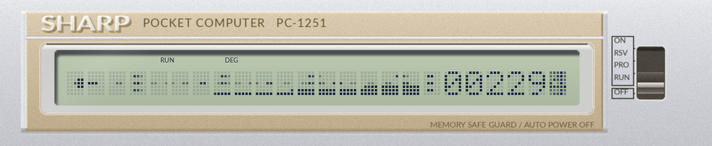

# ポケコンPC-1251の画面シミュレータ

SHARP PC-1251の画面だけを模したシミュレータと、その上で動くデモです。

**これはエミュレータではありません。** 再現したのは画面の見た目だけで、
CPU(SC61860)もメモリもBASICインタプリタもキーボードも実装していません。
実機のプログラムは動きませんし、SC61860の機械語も解釈できません。
プログラムはPythonで書き、`Machine`のメソッドを呼んでドットを表示します。



## 動かし方

```sh
uv run play.py                 # メニューから選ぶ
uv run play.py sky_cave        # 直接1本だけ動かす
uv run play.py jump_hero --scale 0.7
uv run play.py --mute          # 音を鳴らさない
uv run play.py --persist 0     # 残像を切る
```

`uv`がなければ`pip install pygame pillow`してから`python play.py`でも動きます。

ウィンドウは原寸で横1425pxです。`--scale`で拡大縮小できますが、上限は
デスクトップに収まる大きさまでです。横幅で頭打ちになるので、1920pxの画面
なら1.29倍あたりが限界になります。

## 操作

| キー | 働き |
| --- | --- |
| ← → / 1〜5 | メニューで選ぶ |
| SPACE / ENTER | 決定、ジャンプ、ショット |
| ↑ ↓ | SKY CAVEで上下、SIDE BREAKでパドル |
| ESC | 中断。メニューへ戻る(直接起動していれば終了) |
| [ ] | 残像の強さを変える(0 / 0.25 / … / 3.0) |

メニューの内容は左右の矢印で選択し、ESCで終了します。

いずれもレベル調整などは一切していないので、ゲームバランスは悪いかも。

## 収録

### SKY CAVE


洞窟を進む横スクロールシューティングです。洞窟は縦24ドットの仮想画面に描いて
あり、そこを縦7ドットの窓が自機を追って上下します。通路の高さは6ドットから
12ドットのあいだで変わり、上下にうねります。壁に触れると1機失います。

しばらく進むと洞窟が開けてボスが出ます。全高15ドットあるので一度には画面に
入りません。装甲を撃っても弾を吸われるだけで、当たるのは中央の砲口の奥にある
核だけです。砲口は周期的に閉じるので、開いているあいだに撃ち込みます。倒すと
次の面へ進みます。自機は3機あり、やられても同じ場所から出直します。出直した
直後はしばらく無敵で、そのあいだ自機が点滅します。残機数は得点の左に出る
横棒の本数で分かります。

### JUMP HERO


走って跳ぶアクションです。ボタンを長く押すほど高く跳びます。段と敵は跳んで
越え、穴は全力で跳ばないと落ちます。天井から下がっている岩は逆で、跳びすぎる
と頭をぶつけます。コインは弧を描いて並んでいるので、真ん中の高いところは
跳ばないと届きません。1600ドット走るとゴールの旗にたどり着きます。ゴール
すると次の面がはじまり、面ごとに走る速さが上がります。

### SIDE BREAK


横向きのブロック崩しです。左のパドルで玉を打ち返し、右の壁を削ります。壁と
画面の右端のあいだは空いているので、そこへ回り込ませると壁を裏から削れます。
点滅しているブロックを壊すと玉が増えます(最大4個)。壁はゆっくり左へ寄って
きますが、手前の列を崩すと壁の先端が奥へ下がるので、そのぶん時間を稼げます。

### CHARACTER


ドット絵を眺めるだけのプログラムです。何かキーを押すと戻ります。絵は
`programs/character.py`にドット絵のまま置いてあるので、書き換えれば別の顔に
なります。

### PC-INT


「PC-インタープリタ」の文法で書いたプログラムを動かします。出典は工学社
「PiO」1986年8月号 169〜171ページ、作者は
[Fan_PC-1251](https://x.com/pio1986_10)氏です。
オリジナルの処理系はPC-1245/51/55用のマシン語でしたが、
ここでは表層的にPC-インタープリタのプログラムを解釈しています。上の画面は
同梱の`wave.pci`で、波の形を配列に置いて左から1列ずつ描いています。
書き方は[PCINT.md](PCINT.md)にあります。

## プログラムの書き方

`examples/`に短い例が入っています。

```sh
uv run play.py hello     # 文字を出すだけ
uv run play.py text      # 文字をセルにそろえる。電光掲示板
uv run play.py car       # ← → で車が動く
uv run play.py scroll    # 景色が流れる
uv run play.py catch     # 落ちてくるものを受ける。いちばん短いゲーム
uv run play.py tall      # 画面より大きい仮想画面を窓で切り取る
```

書き方は[PROGRAMS.md](PROGRAMS.md)、例の一覧は
[examples/README.md](examples/README.md)にあります。

## 構造

マシン(シミュレータ)とゲームを分けてあります。

```
pc1251/          マシン側。ゲームからはMachineとBufferしか見えない
  buffer.py        120xNドットのバッファと描画プリミティブ
  font.py          5x7のフォント
  panel.py         筐体と液晶の絵
  machine.py       pygameのウィンドウ、キー、フレーム時計、液晶の応答モデル
  body.png         描画済みの筐体(下記)
examples/        入門用の短い例
programs/        ポケコンの上で動くプログラム
  menu.py          ランチャー
  sky_cave.py
  jump_hero.py
  side_break.py
  character.py
  pcint/           PC-インタープリタの文法で書いたものを動かす
    interp.py        その処理系
    progs/           .pciのプログラム
play.py          マシンを1台立ち上げてプログラムを走らせる
tools/           READMEに載せる画像を撮る道具、動作を試す道具
docs/            その画像
PROGRAMS.md      programs/に書くときの手引き
PCINT.md         PC-インタープリタの文法
```

**programs/の下ではpygameもPillow(PIL)もimportしません。** 画面・入力・時間は
すべて`Machine`を通すので、表示側を差し替えてもゲームのコードはそのまま
動きます。書き方は[PROGRAMS.md](PROGRAMS.md)を参照してください。

## 画面について

- 描けるのは **120x7ドット**。5x7ドットの文字セルが24個ならんだものです
  (実機の言い方では24桁)。
- セルとセルのあいだの1ドットは物理的に存在しないので、横線を引くと
  セルの境目で切れます。実機と同じです。
- 液晶の応答が遅いので、速く動くドットには残像が出ます。点灯33ms、消灯86msの
  時定数で、`panel.TAU_RISE_MS` / `TAU_FALL_MS`にあります。残像の程度は
  `[`と`]`、または`--persist`で変えられます。
- 音は圧電ブザーの矩形波を模しています。ループ1周が8サイクル、CPUが576kHz
  として計算しており、周波数は f = 36000/n のみとしています。nが整数なので
  音程は飛び飛びになります(これは正しくないかも知れない…)。対応するコードは
  `pc1251/sound.py`にあります。

筐体の絵は`pc1251/body.png`に描画済みのものを同梱してあります。刻印用の欧文
フォントが入っていない環境でも見た目が変わらないようにするためです。描き直す
には`PC1251_REBUILD=1 uv run play.py`。フォントはOSごとの候補から探し、
見つからなければPillowの既定フォントが使われます。

## ライセンス

MITライセンスです(詳しくは[LICENSE](LICENSE))。

SHARPとPC-1251はシャープ株式会社の商標です。MITが許諾しているのは著作権に
ついてで、商標の使用許諾は含みません。これは非公式の個人制作物で、同社とは
関係ありません。
